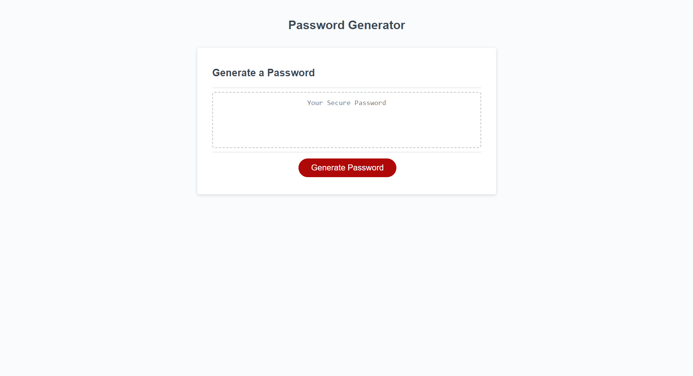
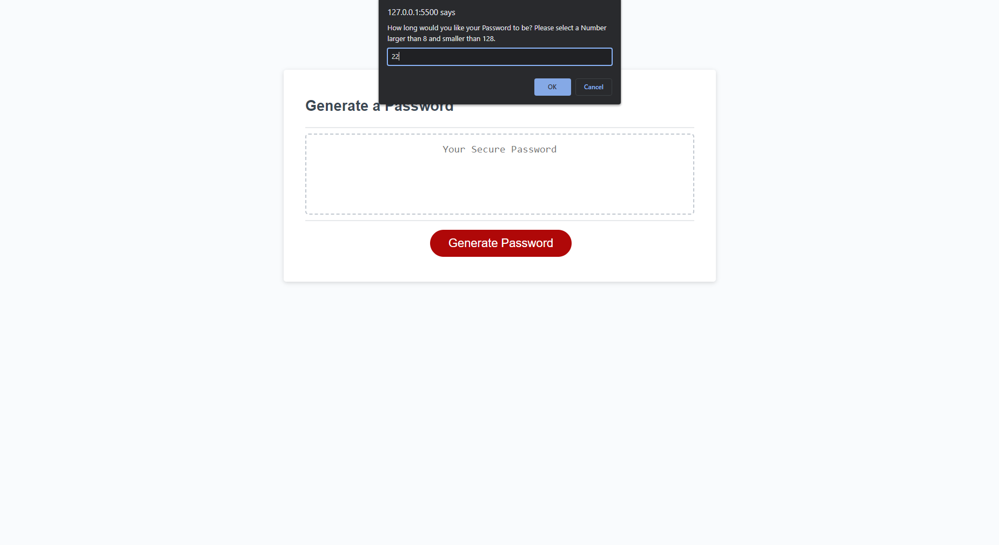

# opensesame
## a random password generator

The purpose of this website is to generate a password according to requirements given by user input through prompts.
## Visit the Website
[click me!](https://azrazel95.github.io/opensesame/)

the website before input.

an example of a prompt.

the result of the user input!

## contributing

please do not contribute

## License

This project has been licensed under the MIT License
---
© benjamin sprenger 